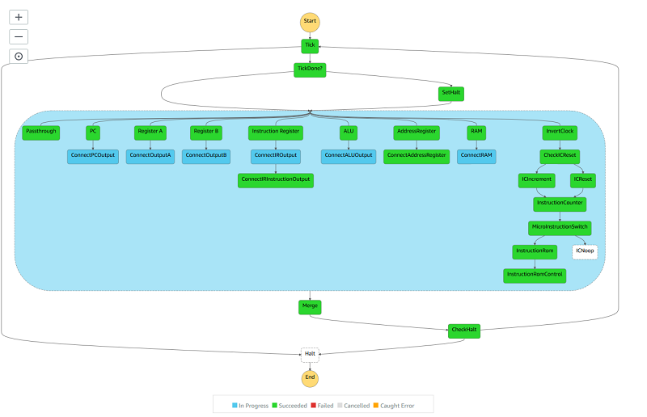

# Lambputer

A computer emulation that runs on top of AWS Lamabda and Step Functions.

## FAQ

Q: Does it actually run machine code?
A: yes

Q: How well does it run?
A: Terribly! it takes 2 minutes and thousands of state transitions to add 2 numbers from its RAM.

Q: Why did you do this?
A: Computers a neat state machines and I wanted to experiment with the model and architecture. I hope to get inspiration and apply learned patterns for useful applications.
